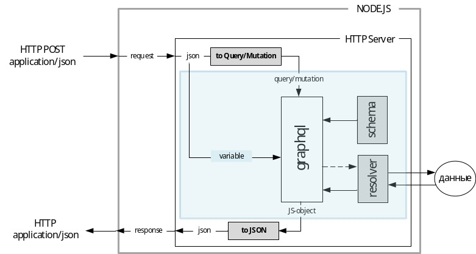

#### Поясните понятие GraphQL.

- **GraphQL** - формальный язык запросов. (lecture)
- **GraphQL** - язык запросов данных и язык манипулирования данными с открытым исходным кодом для построения веб ориентированных программных интерфейсов. 

---
#### Поясните понятие схема GraphQL.

**Схема GraphQL** - это описание ваших типов данных на сервере, связей между ними и логики получения этих самых данных. 

---
#### Расшифруйте аббревиатуру SDL GraphQL.

Schema Definition Language

---
#### Поясните понятие resolver GraphQL.

**Resolver GraphQL** - это функция ответственная за получение значений пользовательского типа или поля это типа.

---
#### Поясните понятие query GraphQL.

**Query GraphQL** - первый из двух видов операция над данными в GraphQL, предназначен для получения данных.  

---
#### Поясните понятие mutation GraphQL.

**Mutation GraphQL** - второй из двух видов операция над данными в GraphQL, предназначен для изменения данных.

---
#### Поясните понятие subscription GraphQL.
#### Поясните понятие context GraphQL.

**Context GraphQL** - объект передающийся в resolver функции для dependency injection.

---
#### Поясните схему работы модуля graphql

---
#### Поясните следующие компоненты interface, enum, fragment, union схемы GraphQL.

- **interface** - элемент описывающий набор полей пользовательских типов. Наследуется пользоватеским типом.
- **enum** - перечисление.
- **fragment** - это то что ты пишешь в postman например. Это запрос в GraphQL.
- **union** - тип объекта способный хранить в себе одно значение одного из заданных типов.
